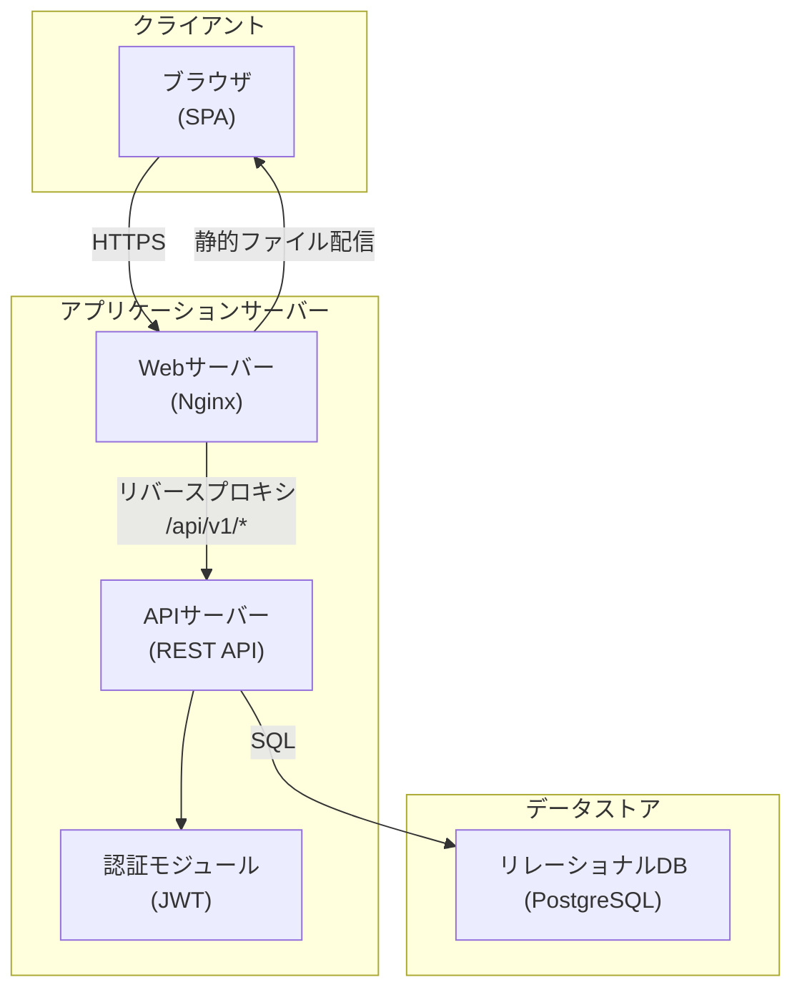
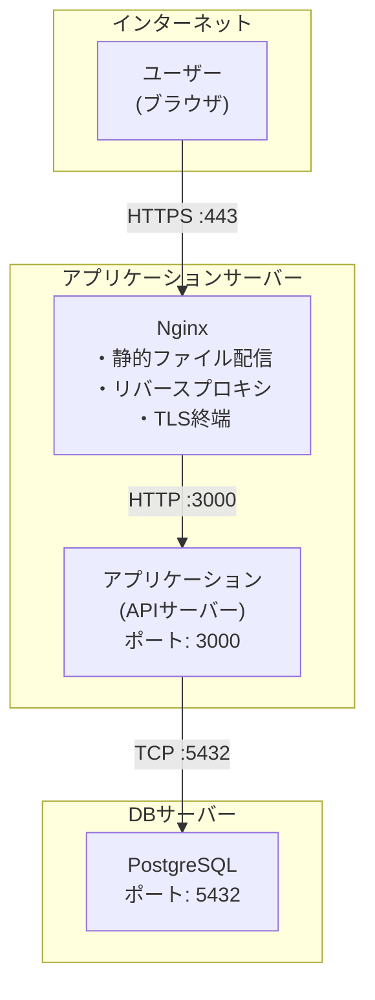
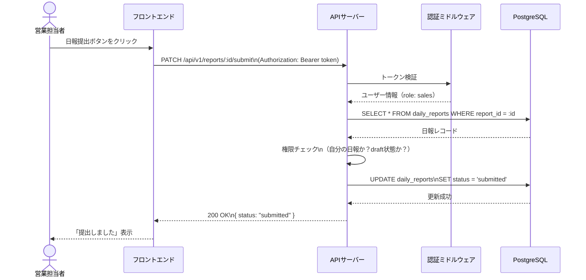
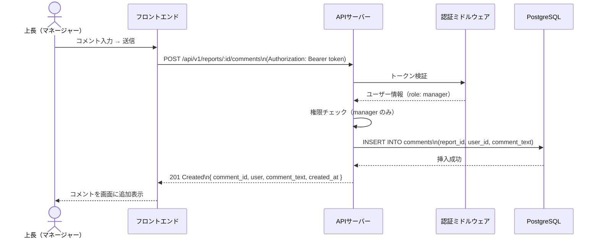
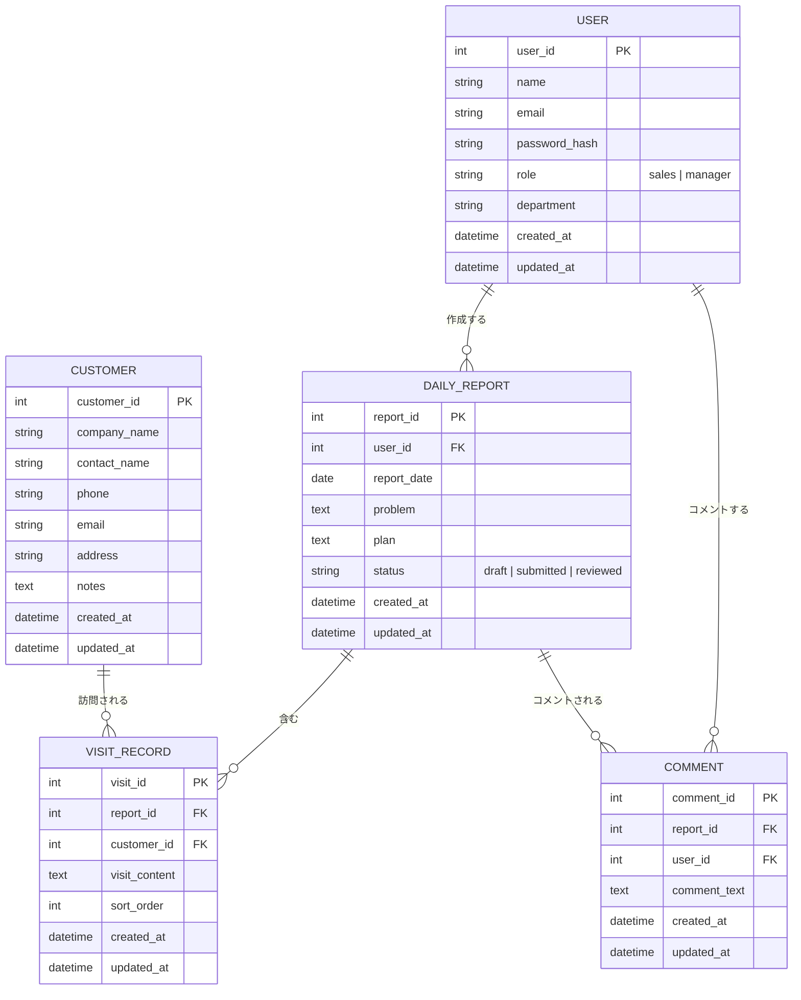

# 営業日報システム システム構成図

## 全体アーキテクチャ

```mermaid
graph TB
    subgraph Client["クライアント"]
        Browser["ブラウザ\n(SPA)"]
    end

    subgraph Server["アプリケーションサーバー"]
        WebServer["Webサーバー\n(Nginx)"]
        AppServer["APIサーバー\n(REST API)"]
        AuthModule["認証モジュール\n(JWT)"]
    end

    subgraph DB["データストア"]
        RDB["リレーショナルDB\n(PostgreSQL)"]
    end

    Browser -->|"HTTPS"| WebServer
    WebServer -->|"静的ファイル配信"| Browser
    WebServer -->|"リバースプロキシ\n/api/v1/*"| AppServer
    AppServer --> AuthModule
    AppServer -->|"SQL"| RDB
```

---

## コンポーネント構成

```mermaid
graph LR
    subgraph Frontend["フロントエンド (SPA)"]
        Pages["画面コンポーネント"]
        APIClient["APIクライアント"]
        AuthStore["認証状態管理"]
    end

    subgraph Backend["バックエンド"]
        Router["ルーター"]
        AuthMiddleware["認証・認可\nミドルウェア"]

        subgraph Controllers["コントローラー"]
            AuthCtrl["AuthController"]
            ReportCtrl["ReportController"]
            VisitCtrl["VisitController"]
            CommentCtrl["CommentController"]
            CustomerCtrl["CustomerController"]
            UserCtrl["UserController"]
        end

        subgraph Services["サービス層"]
            AuthSvc["AuthService"]
            ReportSvc["ReportService"]
            CustomerSvc["CustomerService"]
            UserSvc["UserService"]
        end

        subgraph Repositories["リポジトリ層"]
            ReportRepo["ReportRepository"]
            VisitRepo["VisitRepository"]
            CommentRepo["CommentRepository"]
            CustomerRepo["CustomerRepository"]
            UserRepo["UserRepository"]
        end
    end

    subgraph DataStore["データストア"]
        DB[("PostgreSQL")]
    end

    Pages --> APIClient
    APIClient -->|"Bearer Token"| Router
    Router --> AuthMiddleware
    AuthMiddleware --> Controllers
    Controllers --> Services
    Services --> Repositories
    Repositories -->|"SQL"| DB
```

---

## デプロイ構成

```mermaid
graph TB
    User["ユーザー\n(ブラウザ)"]

    subgraph Internet["インターネット"]
        User
    end

    subgraph AppServer["アプリケーションサーバー"]
        Nginx["Nginx\n・静的ファイル配信\n・リバースプロキシ\n・TLS終端"]
        App["アプリケーション\n(APIサーバー)\nポート: 3000"]
    end

    subgraph DBServer["DBサーバー"]
        PG["PostgreSQL\nポート: 5432"]
    end

    User -->|"HTTPS :443"| Nginx
    Nginx -->|"HTTP :3000"| App
    App -->|"TCP :5432"| PG
```

---

## データフロー — 日報提出

```mermaid
sequenceDiagram
    actor Sales as 営業担当者
    participant FE as フロントエンド
    participant API as APIサーバー
    participant Auth as 認証ミドルウェア
    participant DB as PostgreSQL

    Sales->>FE: 日報提出ボタンをクリック
    FE->>API: PATCH /api/v1/reports/:id/submit\n(Authorization: Bearer token)
    API->>Auth: トークン検証
    Auth-->>API: ユーザー情報（role: sales）

    API->>DB: SELECT * FROM daily_reports WHERE report_id = :id
    DB-->>API: 日報レコード

    API->>API: 権限チェック\n（自分の日報か？draft状態か？）

    API->>DB: UPDATE daily_reports\nSET status = 'submitted'
    DB-->>API: 更新成功

    API-->>FE: 200 OK\n{ status: "submitted" }
    FE-->>Sales: 「提出しました」表示
```

---

## データフロー — 上長コメント追加

```mermaid
sequenceDiagram
    actor Manager as 上長（マネージャー）
    participant FE as フロントエンド
    participant API as APIサーバー
    participant Auth as 認証ミドルウェア
    participant DB as PostgreSQL

    Manager->>FE: コメント入力 → 送信
    FE->>API: POST /api/v1/reports/:id/comments\n(Authorization: Bearer token)
    API->>Auth: トークン検証
    Auth-->>API: ユーザー情報（role: manager）

    API->>API: 権限チェック（manager のみ）

    API->>DB: INSERT INTO comments\n(report_id, user_id, comment_text)
    DB-->>API: 挿入成功

    API-->>FE: 201 Created\n{ comment_id, user, comment_text, created_at }
    FE-->>Manager: コメントを画面に追加表示
```

---

## テーブル構成（再掲）

```mermaid
erDiagram
    USER {
        int user_id PK
        string name
        string email
        string password_hash
        string role "sales | manager"
        string department
        datetime created_at
        datetime updated_at
    }

    CUSTOMER {
        int customer_id PK
        string company_name
        string contact_name
        string phone
        string email
        string address
        text notes
        datetime created_at
        datetime updated_at
    }

    DAILY_REPORT {
        int report_id PK
        int user_id FK
        date report_date
        text problem
        text plan
        string status "draft | submitted | reviewed"
        datetime created_at
        datetime updated_at
    }

    VISIT_RECORD {
        int visit_id PK
        int report_id FK
        int customer_id FK
        text visit_content
        int sort_order
        datetime created_at
        datetime updated_at
    }

    COMMENT {
        int comment_id PK
        int report_id FK
        int user_id FK
        text comment_text
        datetime created_at
        datetime updated_at
    }

    USER ||--o{ DAILY_REPORT : "作成する"
    USER ||--o{ COMMENT : "コメントする"
    DAILY_REPORT ||--o{ VISIT_RECORD : "含む"
    DAILY_REPORT ||--o{ COMMENT : "コメントされる"
    CUSTOMER ||--o{ VISIT_RECORD : "訪問される"
```
